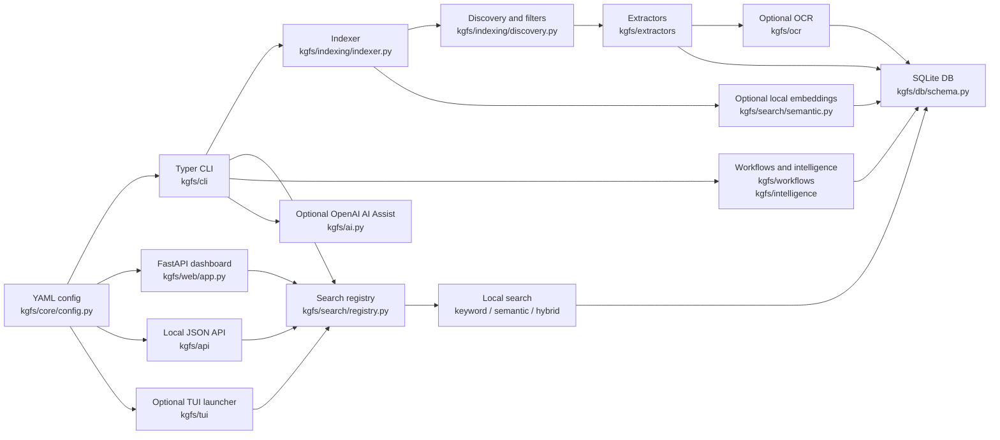

# KGFS Documentation

KG File Search (KGFS) is a private, local-first Python file search tool. It indexes only folders explicitly listed by the user, stores metadata and extracted text in a local SQLite database, searches with SQLite FTS5 keyword ranking, and can optionally add local OCR, local semantic/vector search, local workflow/intelligence metadata, a token-gated local JSON API, a Textual TUI launcher, integration scaffolds, or opt-in OpenAI AI Assist.

This documentation is based on the repository state at this commit. Source references point to the files that implement or test each claim.

## What KGFS Does

- Creates a no-scan default YAML config with `indexed_folders: []`.
- Indexes configured folders without deleting, moving, renaming, or overwriting source files.
- Skips noisy, system, dependency, cache, application, game, binary, media, archive, and over-size files by default.
- Extracts text from text-like files, Markdown, code, CSV, DOCX, PDF, and optionally OCR-supported image files through local Tesseract.
- Stores file records, FTS rows, latest result IDs, semantic chunks, OCR cache rows, workflow metadata, file-intelligence metadata, and schema metadata in SQLite.
- Searches with keyword, semantic, hybrid, and auto modes, plus score explanations for latest results.
- Provides local investigation and workflow commands for deep search, similar files, compare, timeline, research, profiles, saved searches, collections, tags, notes, assignments, projects, duplicates, versions, graphs, health, and metadata backups.
- Provides CLI commands for init, doctor, config, folder management, indexing, search, why, AI-assisted ask/rerank, semantic indexing/search, OCR, vectors, stats, open/reveal, prune, reset, rebuild, a local web dashboard, a local JSON API, a TUI launcher, and integration scaffolds.
- Packages with PyInstaller for Windows and macOS builds.

Primary source files:

- CLI wiring: `kgfs/cli/app.py`, `kgfs/cli/commands/*.py`
- Settings: `kgfs/core/config.py`, `config.example.yaml`
- App paths: `kgfs/core/app_dirs.py`
- Indexing: `kgfs/indexing/*.py`
- Extraction: `kgfs/extractors/*.py`
- Database: `kgfs/db/*.py`
- Search: `kgfs/search/*.py`, `kgfs/search/modes/*.py`
- Vector backends and management: `kgfs/search/backends/*.py`, `kgfs/vectors/*.py`
- Workflows and intelligence: `kgfs/workflows/*.py`, `kgfs/intelligence/*.py`
- Local API: `kgfs/api/*.py`, `kgfs/cli/commands/serve.py`
- TUI and integration scaffolds: `kgfs/tui/*.py`, `kgfs/integrations/*.py`, `kgfs/cli/commands/tui.py`, `kgfs/cli/commands/integrations.py`
- Result explanations: `kgfs/search/explain.py`, `kgfs/cli/commands/why.py`
- AI Assist: `kgfs/ai.py`
- Web dashboard: `kgfs/web/app.py`, `kgfs/web/templates/*.html`
- Packaging: `scripts/build_package.py`, `packaging/pyinstaller/kgfs.spec`, `.github/workflows/package.yml`

## Quickstart

Install for local development:

```bash
python -m pip install -e ".[dev]"
kgfs version
kgfs quickstart
kgfs init
kgfs doctor
kgfs add-folder "./examples/sample-corpus"
kgfs index
kgfs search "motor torque"
```

Project-local mode keeps config and data under `.kgfs/` in the current working directory:

```bash
kgfs init --project-local
kgfs add-folder "./examples/sample-corpus" --project-local
kgfs index --project-local
kgfs search "op amp gain" --project-local
```

The sample corpus is artificial and contains no personal data. Generated config
starts with `indexed_folders: []`, and KGFS never indexes the whole drive by
default.

Optional semantic dependencies:

```bash
python -m pip install -e ".[semantic]"
```

Optional OpenAI AI Assist dependency:

```bash
python -m pip install -e ".[openai]"
```

## Documentation Map

- [Features](features.md): complete feature inventory with implementation and test references.
- [KGFS vs OS Search](kgfs-vs-os-search.md): positioning against Windows Search, Copilot+ improved search, and macOS Spotlight/Finder.
- [Settings](settings.md): config keys, environment variables, CLI flags, runtime options, defaults, and validation behavior.
- [Usage](usage.md): end-user and local development workflows.
- [CLI](cli.md): command-by-command CLI reference.
- [API](api.md): local JSON API routes, web dashboard routes, and library entry points.
- [Architecture](architecture.md): internal module layout, data flows, and extension points.
- [Data Model](data-model.md): SQLite schema, dataclasses, and stored file formats.
- [Integrations](integrations.md): SQLite FTS5, platformdirs, document/OCR parsers, vector backends, FastAPI, Textual, launcher scaffolds, PyInstaller, sentence-transformers, and OpenAI.
- [Security](security.md): privacy, local-first behavior, indexing safety, AI boundaries, and web dashboard exposure.
- [Development](development.md): setup, tests, packaging, and extension guidance.
- [Troubleshooting](troubleshooting.md): common failures, causes, and debug commands.
- [Examples](examples.md): end-to-end workflows.
- [Roadmap](roadmap.md): implemented vs planned behavior.
- [Changelog](../CHANGELOG.md): release notes, versioning guidance, and release checklist.

## High-Level Architecture



## Important Boundaries

- KGFS does not index a whole drive by default.
- `kgfs init` creates config and app directories but does not index.
- `kgfs index` refuses risky roots unless `--allow-risky-root` is passed.
- Prune and reset operations remove only KGFS database/index data, never source files.
- Vector clear removes only KGFS chunk/vector data or optional backend artifacts.
- Workflow and intelligence metadata is stored in KGFS database/app-data/project-local paths, never in source files or sidecars.
- OCR is disabled by default, local-only, and never writes back to source images/PDFs.
- Semantic search is local and optional.
- OpenAI AI Assist is opt-in, downstream of local search, and uses snippets by default.
- The web dashboard has no authentication at this commit and binds to `127.0.0.1` by default.
- The local JSON API requires a bearer token by default and refuses non-localhost binds unless explicitly overridden.
