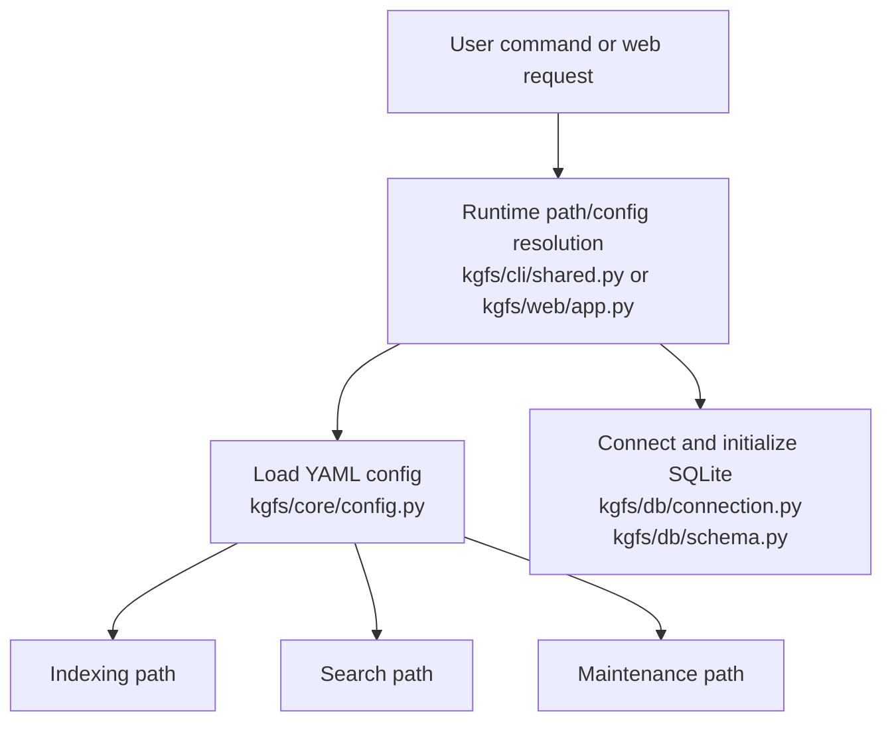
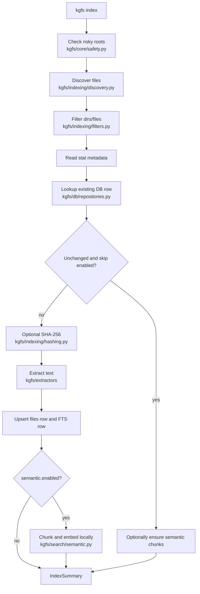
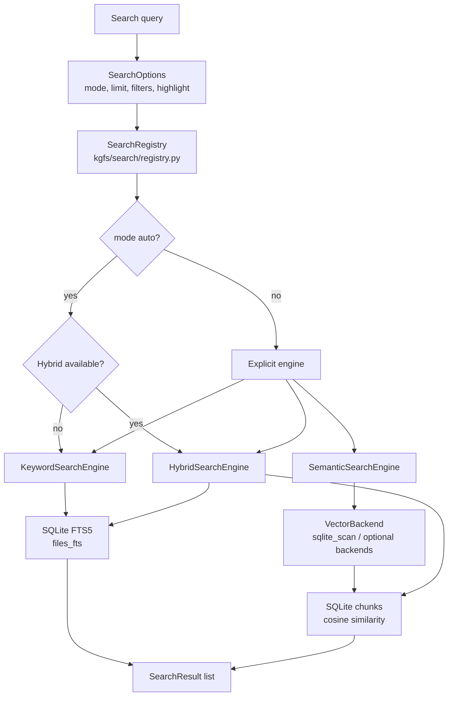
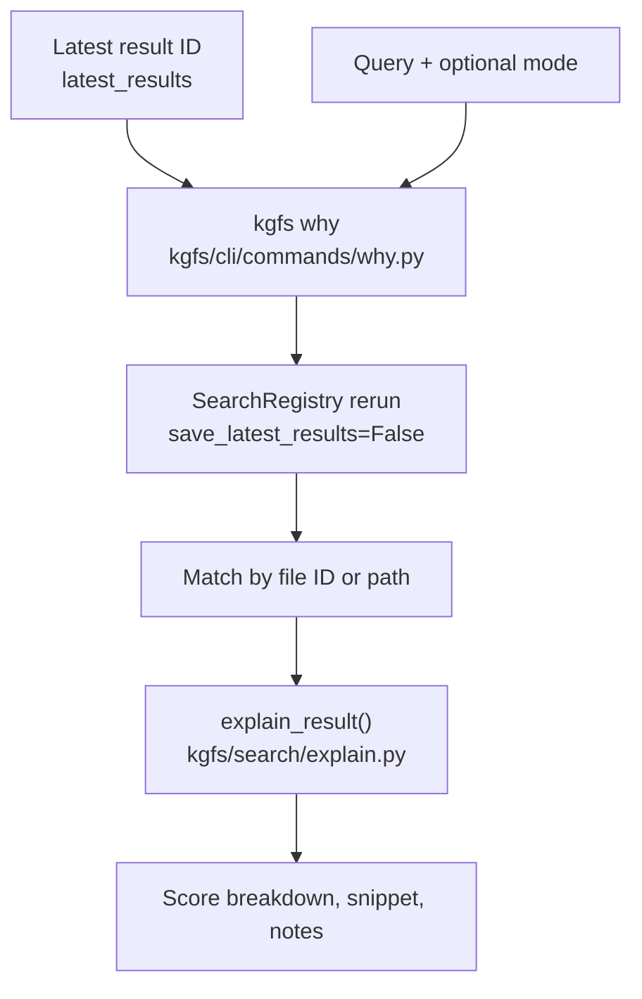
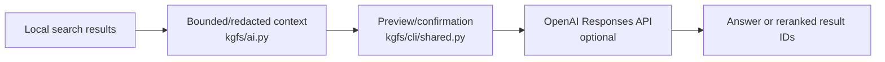

# Architecture

KGFS is a small Python package organized around explicit config, safe indexing, SQLite persistence, and search surfaces. It is local-first by default; optional semantic search uses local sentence-transformers, and optional AI Assist is downstream of local search.

## Package Layout

```text
kgfs/
  __main__.py          python -m kgfs entry point
  cli/                 Typer app, shared helpers, and command modules
  core/                Config, app dirs, path expansion, safety, platform, resources, dataclasses
  db/                  SQLite connection, schema, migrations, repositories, latest results, stats
  indexing/            Discovery, filters, hashing, indexing, pruning
  extractors/          Text extraction by file type
  search/              Query parsing, filters, ranking, snippets, keyword/semantic/hybrid search, engines
  search/backends/     Vector backend interfaces, registry, sqlite_scan, and optional accelerated backends
  search/modes/        Registry engine wrappers for keyword, semantic, hybrid, and auto fallback
  vectors/             Vector status, chunk lifecycle, and rebuild helpers
  web/                 FastAPI dashboard, Jinja templates, static CSS
```

Compatibility modules such as `kgfs/config.py`, `kgfs/database.py`, `kgfs/file_discovery.py`, `kgfs/file_filters.py`, `kgfs/hashing.py`, `kgfs/migrations.py`, `kgfs/models.py`, `kgfs/path_utils.py`, `kgfs/platform_utils.py`, `kgfs/prune.py`, `kgfs/resources.py`, `kgfs/safety.py`, `kgfs/semantic.py`, and `kgfs/snippets.py` alias the newer package locations with `sys.modules`.

Sources: `kgfs/core/*.py`, `kgfs/db/*.py`, `kgfs/indexing/*.py`, `kgfs/search/*.py`, `tests/test_project_structure.py`.

## Main Runtime Flow



CLI runtime lives in `kgfs/cli/shared.py`. Web runtime is an inner helper in `kgfs/web/app.py`. Both resolve config/database paths and initialize the database before command-specific work.

## Indexing Lifecycle



Important details:

- Discovery starts only from `indexed_folders`.
- Missing configured folders are skipped.
- Symlinks are not followed unless `follow_symlinks: true`.
- Default ignored folders and extensions live in `kgfs/core/config.py`.
- Risky roots are refused before DB initialization in the CLI and again in the library indexer.
- Extraction failures are stored as DB records with `extraction_status = "error"` and `extraction_error`.
- `files_fts` rows are replaced whenever a file record is inserted or updated.
- Semantic chunks are stored in SQLite `chunks` rows with vector BLOBs.

Sources: `kgfs/cli/commands/index.py`, `kgfs/indexing/indexer.py`, `kgfs/indexing/discovery.py`, `kgfs/indexing/filters.py`, `kgfs/extractors/*.py`, `kgfs/db/repositories.py`, `tests/test_indexing.py`.

## Search Lifecycle



Search has two layers:

- Direct functions in `kgfs/search/keyword.py`: `search()`, `semantic_search()`, and `hybrid_search()`.
- A mode registry in `kgfs/search/registry.py` and `kgfs/search/modes/*.py`.

The CLI search command uses the registry. The web dashboard currently calls direct keyword `search()` and does not expose semantic/hybrid modes.

Sources: `kgfs/cli/commands/search.py`, `kgfs/search/keyword.py`, `kgfs/search/registry.py`, `kgfs/search/modes/*.py`, `kgfs/web/app.py`, `tests/test_search_kernel.py`, `tests/test_web.py`.

## Result Explanation Lifecycle



`kgfs why` explains saved latest-result IDs. It reruns search with the requested
mode, uses the saved file if the result no longer appears in the rerun, and
prints score components from `SearchResult.score_breakdown`.

Sources: `kgfs/cli/commands/why.py`, `kgfs/search/explain.py`, `kgfs/search/result.py`, `tests/test_cli.py`.

## Keyword Ranking

Keyword search builds an FTS5 query with `build_fts_query()`:

- Tokenizes with Unicode word matching.
- Removes a fixed stopword list.
- Uses prefix terms such as `motor*`.
- Uses `AND` first, then falls back to `OR` if no rows are found.

Ranking combines:

- BM25-derived base score.
- Filename match boost.
- Path match boost.
- Exact phrase match boost.
- Small recent-modification bonus.

Sources: `kgfs/search/query.py`, `kgfs/search/ranking.py`, `kgfs/search/keyword.py`, `tests/test_ranking.py`.

## Semantic and Hybrid Search

Semantic indexing:

1. Extracted text is split by `chunk_text()`.
2. `SentenceTransformerEmbedder` encodes chunks with normalized embeddings.
3. Vectors are packed as little-endian float32 BLOBs.
4. Chunks are stored with file ID, chunk index, text, embedding dimension, offsets, model name, and created timestamp.

Vector backend foundation:

1. `kgfs/search/backends/base.py` defines the vector backend protocol and
   `VectorSearchHit` / `VectorSearchOptions` / `VectorIndexStatus`.
2. `kgfs/search/backends/registry.py` registers known backend names and keeps
   optional dependencies lazy.
3. `kgfs/search/backends/sqlite_scan.py` is the default backend. It scans
   SQLite `chunks`, unpacks BLOB vectors, computes cosine similarity in Python,
   and applies search filters.
4. `sqlite_vec`, `hnsw`, and `faiss` are optional accelerated backends. They
   build/search from KGFS `chunks` when their dependencies are installed and
   enabled, and otherwise report clear unavailable status without making the
   base install import heavy packages.
5. `kgfs/vectors/` owns vector status, clearing, rebuild lifecycle helpers,
   artifact paths, artifact metadata, benchmarking, and recommendation logic.
6. `kgfs vector status`, `kgfs vector rebuild`, `kgfs vector clear --yes`,
   `kgfs vector benchmark`, and `kgfs vector recommend` manage or inspect local
   vector data only.

Semantic search:

1. Embeds the query.
2. Routes the query vector through the configured vector backend.
3. Converts vector hits into `SearchResult` rows.
4. Returns the best chunk per file.

Hybrid search combines semantic score, keyword score, filename relevance, path
relevance, exact phrase relevance, and modest recency. Hybrid results include a
serializable score breakdown with `keyword`, `semantic`, `filename`, `path`,
`exact_phrase`, `recency`, and `final` components. Weights live in the `hybrid`
config section and are normalized at scoring time.

Auto mode uses hybrid only when semantic/vector data is ready. If semantic is
disabled, auto quietly uses keyword; if semantic is enabled but not ready, auto
prints one fallback warning and uses keyword.

`kgfs why RESULT_ID QUERY` reads the latest saved search result, reruns local
search, and formats a `SearchExplanation`. It does not open files, reveal
folders, call AI, or modify indexed source files.

Sources: `kgfs/search/semantic.py`, `kgfs/search/keyword.py`, `kgfs/search/backends/*.py`, `kgfs/search/modes/semantic.py`, `kgfs/search/modes/hybrid.py`, `kgfs/vectors/*.py`, `tests/test_semantic.py`, `tests/test_vector_backend.py`, `tests/test_vector_backend_registry.py`, `tests/test_vector_benchmark.py`, `tests/test_vector_recommend.py`, `tests/test_vector_status.py`.

## Database Architecture

SQLite is the only persistence layer at this commit.

Tables:

- `files`: indexed file metadata, extracted text, status, hash, and timestamps.
- `files_fts`: FTS5 virtual table for file name, path, and extracted text.
- `latest_results`: most recent search result IDs for open/reveal.
- `chunks`: semantic text chunks and vector BLOBs.
- `schema_version`: migration version marker.

`initialize_database()` creates core tables, calls `migrate_database()`, and commits. Current schema version is `1`.

Sources: `kgfs/db/schema.py`, `kgfs/db/migrations.py`, `kgfs/db/repositories.py`, `kgfs/db/latest_results.py`, [Data Model](data-model.md).

## Web Dashboard Architecture

`create_app()` builds a FastAPI app and mounts static assets from resource paths that work in source checkouts and PyInstaller bundles.

Routes:

- `GET /`: summary metrics.
- `GET /search`: keyword search with filters.
- `GET /stats`: database stats.
- `GET /config`: active config dump.
- `GET /failures`: recent extraction failures.
- `GET /open/{result_id}` and `GET /reveal/{result_id}`: OS open/reveal actions for latest results.

Sources: `kgfs/web/app.py`, `kgfs/core/resources.py`, `kgfs/web/templates/*.html`, `tests/test_web.py`.

## AI Assist Architecture

AI Assist is downstream of local search:



Privacy defaults:

- Disabled by default.
- Requires API key from environment.
- Sends snippets, not full file text.
- Omits paths by default.
- Redacts home paths by default.
- Prints preview and asks for confirmation by default.

Sources: `kgfs/ai.py`, `kgfs/cli/commands/search.py`, `kgfs/cli/shared.py`, `tests/test_ai.py`.

## Error Handling

| Area | Behavior | Source |
|---|---|---|
| Missing config for required runtime | `load_config()` reads the resolved path and will fail if missing. | `kgfs/core/config.py`, `kgfs/cli/shared.py` |
| Optional config runtime | Commands such as `doctor` and `reset-index` use defaults when config is missing. | `kgfs/cli/shared.py` |
| Risky roots | CLI exits with code 2; library raises `RiskyRootError`. | `kgfs/cli/commands/index.py`, `kgfs/indexing/indexer.py` |
| Missing or unreadable files during discovery | Missing roots skipped; stat errors skip file and can increment failures. | `kgfs/indexing/discovery.py`, `kgfs/indexing/indexer.py` |
| Extraction failures | Stored with `extraction_status="error"` and `extraction_error`. | `kgfs/extractors/*.py`, `kgfs/indexing/indexer.py` |
| FTS query operational error | Keyword search returns an empty result list. | `kgfs/search/keyword.py` |
| Unknown search mode | Raises `UnknownSearchMode`; CLI reports bad parameter. | `kgfs/search/registry.py`, `kgfs/cli/commands/search.py` |
| Semantic unavailable | Raises `SearchModeUnavailable` for explicit semantic/hybrid search. Auto falls back to keyword with warning. | `kgfs/search/registry.py`, `kgfs/search/modes/semantic.py` |
| Unknown vector backend | Vector status reports unavailable; semantic/hybrid modes report a helpful unavailable message with known backend names. | `kgfs/search/backends/registry.py`, `kgfs/vectors/status.py` |
| AI disabled, missing SDK, missing API key, unsupported provider | Raises `AIError`; CLI reports bad parameter. | `kgfs/ai.py`, `kgfs/cli/commands/search.py` |
| Newer DB schema | Raises `RuntimeError`. | `kgfs/db/migrations.py` |

## Logging and Telemetry

No structured logging or telemetry pipeline is implemented at this commit. `kgfs doctor` reports a log path from platformdirs, but no code writes runtime logs there. Console output uses Rich through `kgfs/cli/shared.py`.

Sources: `kgfs/cli/shared.py`, `kgfs/cli/commands/doctor.py`, `kgfs/core/app_dirs.py`.

## Security and Auth Boundaries

- Indexing is opt-in by configured path.
- Risky roots are blocked by default.
- Prune/reset do not delete source files.
- Open/reveal behavior is isolated in `kgfs/core/platform_utils.py`; tests enforce that `platform.system()` checks are not scattered.
- Web dashboard has no authentication and should stay bound to localhost unless the operator understands the exposure.
- AI Assist is opt-in and context-bounded.

Sources: `AGENTS.md`, `kgfs/core/safety.py`, `kgfs/core/platform_utils.py`, `tests/test_platform_boundary.py`, [Security](security.md).

## Extension Points

| Extension | Where to change | Required tests |
|---|---|---|
| New CLI command | Add module under `kgfs/cli/commands/` and register it in `kgfs/cli/app.py`. | CLI exposure and behavior tests in `tests/test_cli.py` or focused test file. |
| New config key | Add Pydantic field in `kgfs/core/config.py`, update `DEFAULT_CONFIG_YAML`, `config.example.yaml`, docs, and tests. | `tests/test_config.py` plus feature tests. |
| New extractor | Add extractor module under `kgfs/extractors/`, update dispatch in `kgfs/extractors/__init__.py`, update default extensions if enabled by default. | `tests/test_extractors.py` and indexing/search tests. |
| New DB schema | Update `kgfs/db/schema.py`, migration logic in `kgfs/db/migrations.py`, and data-model docs. | `tests/test_migrations.py` and repository tests. |
| New search mode | Add engine under `kgfs/search/modes/`, register in `build_default_search_registry()`, extend `SearchMode` enum if user-facing. | `tests/test_search_kernel.py`, CLI tests if exposed. |
| New web route | Add route in `kgfs/web/app.py` and template/static assets as needed. | `tests/test_web.py`. |
| New packaging asset | Update `packaging/pyinstaller/kgfs.spec` and `scripts/build_package.py` archive contents. | `tests/test_packaging_scripts.py`, packaged smoke test. |
