# Architecture

KGFS is a small Python package organized around explicit config, safe indexing, SQLite persistence, and search surfaces. It is local-first by default; optional semantic search uses local sentence-transformers, and optional AI Assist is downstream of local search.

## Package Layout

```text
kgfs/
  __main__.py          python -m kgfs entry point
  cli/                 Typer app, shared helpers, and command modules
  core/                Config, app dirs, path expansion, safety, platform, resources, dataclasses
  db/                  SQLite connection, schema, migrations, repositories, latest results, stats
  indexing/            Discovery, filters, hashing, indexing, pruning
  extractors/          Text extraction by file type
  ocr/                 Optional local OCR backend, cache, status, and PDF fallback helpers
  media/               Optional local media metadata, EXIF, captions, transcripts, visual embeddings
  models/              Optional local model backend registry, validation, paths, snippets, testing
  search/              Query parsing, filters, ranking, snippets, citations, keyword/semantic/hybrid search, and advanced local investigation helpers
  search/backends/     Vector backend interfaces, registry, sqlite_scan, and optional accelerated backends
  search/modes/        Registry engine wrappers for keyword, semantic, hybrid, and auto fallback
  vectors/             Vector status, chunk lifecycle, backend artifacts, and rebuild helpers
  workflows/           Local profiles, saved searches, collections, tags, notes, assignments, and projects
  intelligence/         Local duplicates, versions, project candidates, graph, health, metadata backup
  web/                 FastAPI dashboard, Jinja templates, static CSS
  api/                 Token-gated local JSON API app, auth, routes, response models
  tui/                 Optional Textual TUI launcher and small state/action helpers
  integrations/        Raycast/Alfred/PowerToys/Finder/Explorer/tray scaffolds
```

Compatibility modules such as `kgfs/config.py`, `kgfs/database.py`, `kgfs/file_discovery.py`, `kgfs/file_filters.py`, `kgfs/hashing.py`, `kgfs/migrations.py`, `kgfs/path_utils.py`, `kgfs/platform_utils.py`, `kgfs/prune.py`, `kgfs/resources.py`, `kgfs/safety.py`, `kgfs/semantic.py`, and `kgfs/snippets.py` alias the newer package locations with `sys.modules`.

Sources: `kgfs/core/*.py`, `kgfs/db/*.py`, `kgfs/indexing/*.py`, `kgfs/search/*.py`, `tests/test_project_structure.py`.

## Main Runtime Flow

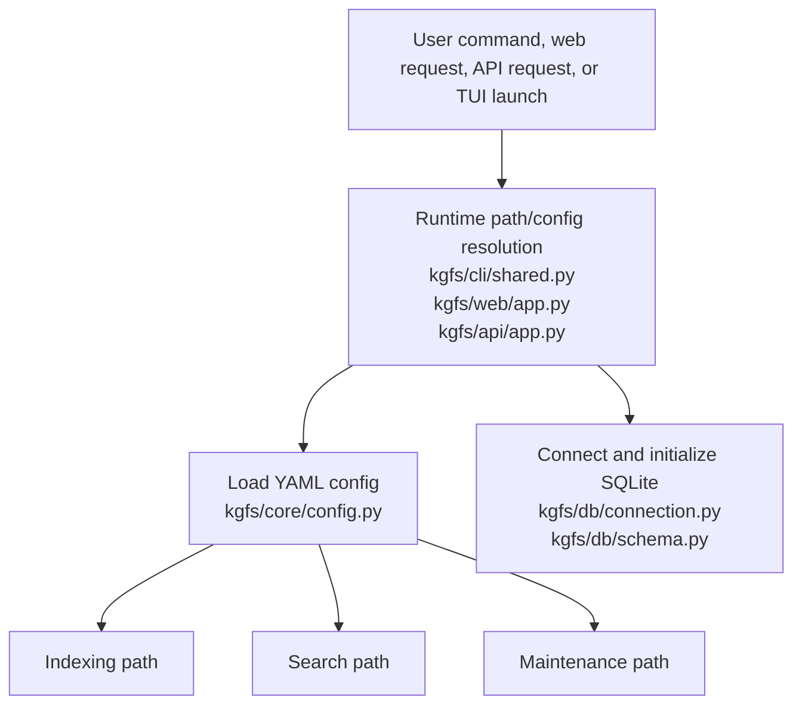

CLI runtime lives in `kgfs/cli/shared.py`. Web/API runtimes are inner helpers in `kgfs/web/app.py` and `kgfs/api/app.py`. These surfaces resolve config/database paths and initialize the database before command-specific work.

## Indexing Lifecycle

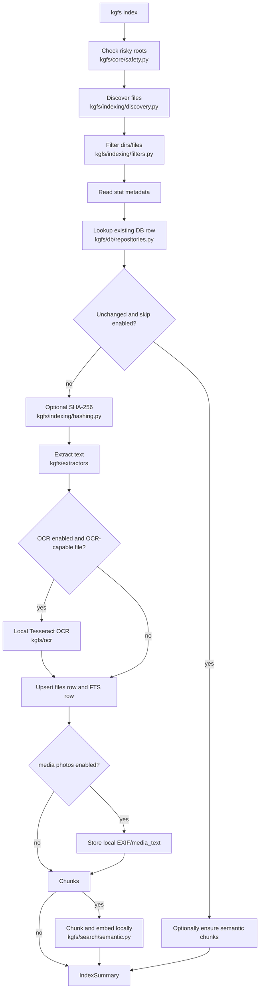

Important details:

- Discovery starts only from `indexed_folders`.
- Missing configured folders are skipped.
- Symlinks are not followed unless `follow_symlinks: true`.
- Default ignored folders and extensions live in `kgfs/core/config.py`.
- Risky roots are refused before DB initialization in the CLI and again in the library indexer.
- Extraction failures are stored as DB records with `extraction_status = "error"` and `extraction_error`.
- OCR is disabled by default. When enabled, OCR-supported image files are allowed through filtering, processed by local Tesseract, cached in KGFS data, and stored as normal extracted text with `extraction_source = "ocr"`.
- Media/photo metadata is disabled by default. When enabled, configured photo extensions are allowed through filtering, local EXIF/image metadata is stored in KGFS `media_metadata`, and searchable generated text is stored in `media_text` with labels such as `media:exif`.
- Scanned PDF candidates are detected when normal PDF text is below the configured threshold; full page rasterization is safely scaffolded for a later pass.
- `files_fts` rows are replaced whenever a file record is inserted or updated.
- Semantic chunks are stored in SQLite `chunks` rows with vector BLOBs.

Sources: `kgfs/cli/commands/index.py`, `kgfs/indexing/indexer.py`, `kgfs/indexing/discovery.py`, `kgfs/indexing/filters.py`, `kgfs/extractors/*.py`, `kgfs/db/repositories.py`, `tests/test_indexing.py`.

## OCR Architecture

OCR is treated as a text extraction source, not a separate search system:

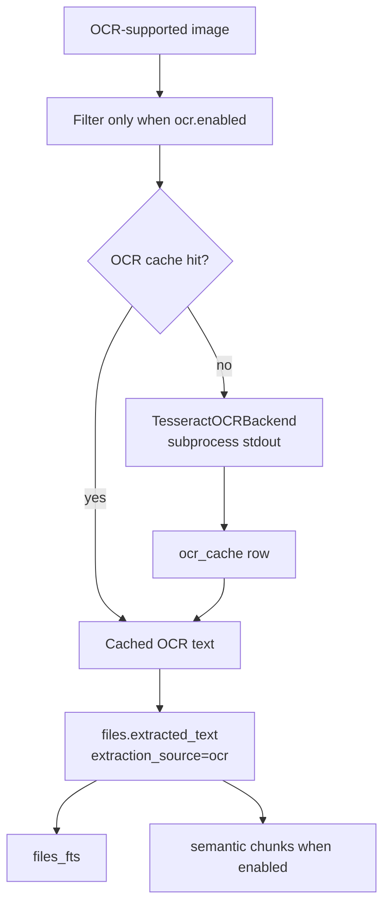

The OCR package owns only local behavior:

- `kgfs/ocr/base.py`: backend/status/result dataclasses.
- `kgfs/ocr/registry.py`: lazy backend lookup.
- `kgfs/ocr/tesseract.py`: local `tesseract input stdout -l LANG` subprocess integration.
- `kgfs/ocr/cache.py`: SQLite OCR cache rows keyed by path/hash/mtime/backend/language.
- `kgfs/ocr/status.py`: status data for CLI and doctor.
- `kgfs/ocr/pdf.py`: scanned-PDF fallback scaffold.

OCR never modifies source images/PDFs and never writes sidecars beside source files.

## Media Architecture

Media-derived text stays source-separated from normal extraction:

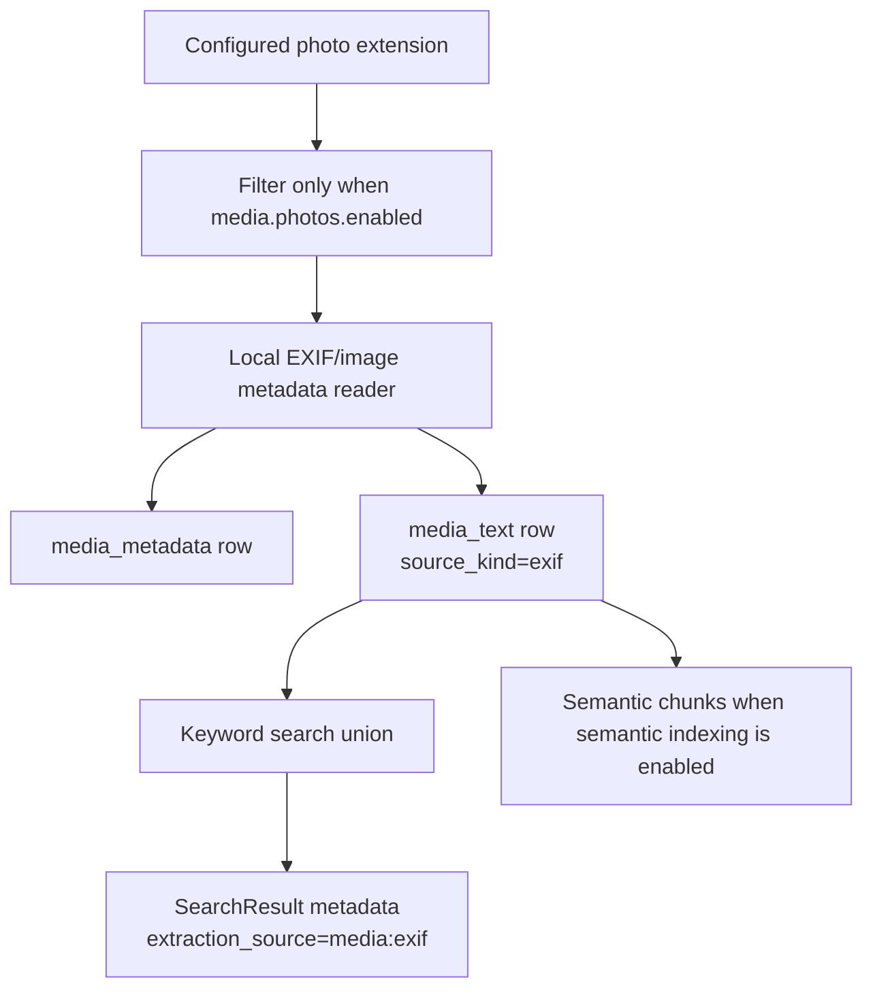

`kgfs/media/` owns photo metadata, media status/counting, safe clear behavior,
and optional caption/audio/visual backend contracts. Captioning,
transcription, and visual embeddings use `none` backends by default. When
enabled, generated text and embeddings are stored in KGFS `media_text` and
`media_embeddings` tables, never beside source files.

Implemented local media/model backends include metadata-derived captions,
optional Transformers image captions, optional faster-whisper transcription,
deterministic bytehash visual embeddings for plumbing/tests, and optional
CLIP-style visual embeddings. These backends stay lazy and optional; they do
not download models by default and do not fake media understanding when
dependencies or local model files are missing.

Advanced OCR backends and cloud OCR fallback are registered lazily under
`kgfs/ocr/`. EasyOCR and PaddleOCR are real optional local adapters when their
extras and local model setup are present.

Cloud OCR fallback is a no-upload scaffold in this phase: it requires disabled
by default config to be changed, an explicit allow-cloud flag, preview, and
confirmation, and still returns "not implemented" rather than uploading.

## Local Model Architecture

The `kgfs/models/` package centralizes optional local backend readiness without
making heavy model stacks part of the base install:

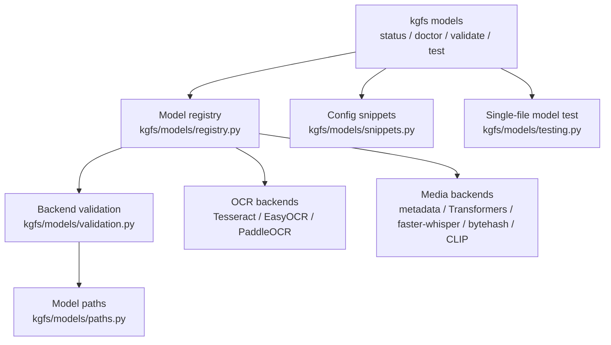

The model layer reports readiness states such as `disabled`, `ready`,
`missing_dependency`, `missing_model`, `configuration_needed`, `scaffold`, and
`error`. It also warns when configured model paths sit inside indexed source
folders, because model caches should not become searchable corpus content by
accident.

Sources: `kgfs/models/*.py`, `kgfs/cli/commands/models.py`, `docs/local-models.md`, `tests/test_phase10_1_local_models.py`, `tests/test_phase10_2_local_model_setup.py`.

## Search Lifecycle

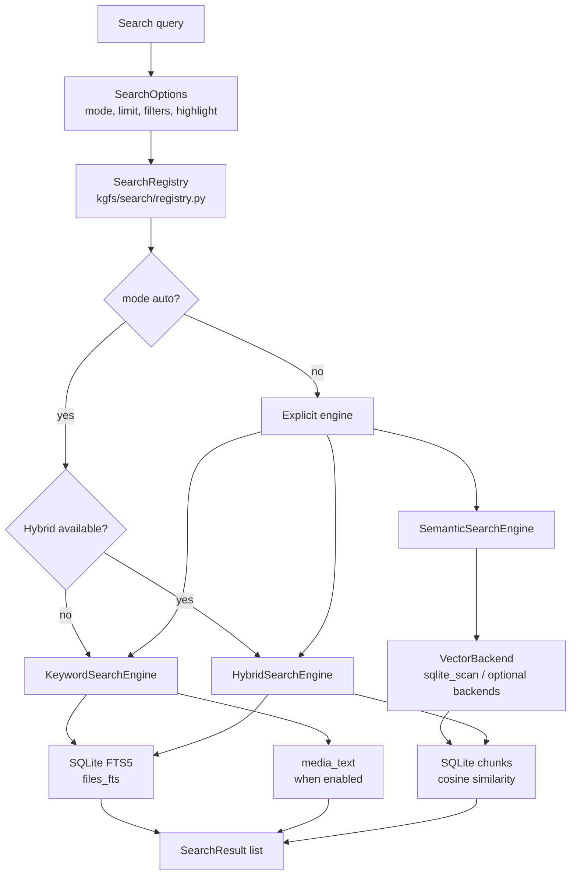

Search has two layers:

- Direct functions in `kgfs/search/keyword.py`: `search()`, `semantic_search()`, and `hybrid_search()`.
- A mode registry in `kgfs/search/registry.py` and `kgfs/search/modes/*.py`.

The CLI search command, local JSON API, and web dashboard search page use the registry. The web dashboard exposes keyword, semantic, hybrid, and auto modes, but it does not expose AI rerank or vector backend overrides.

Sources: `kgfs/cli/commands/search.py`, `kgfs/search/keyword.py`, `kgfs/search/registry.py`, `kgfs/search/modes/*.py`, `kgfs/web/app.py`, `tests/test_search_kernel.py`, `tests/test_web.py`.

## Advanced Local Investigation Lifecycle

Phase 6 commands are built above the search kernel rather than as separate
indexing systems:

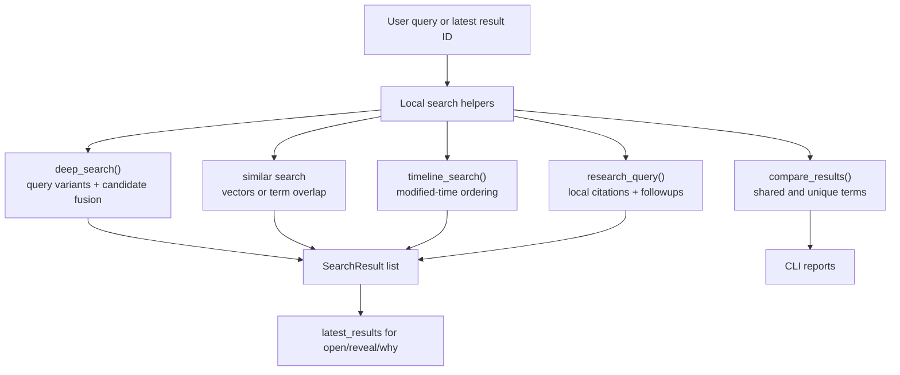

These helpers use extracted text, snippets, latest-result IDs, and optional
local vectors. They do not call AI by default, do not index arbitrary paths
silently, and do not modify source files.

Sources: `kgfs/search/deep.py`, `kgfs/search/similar.py`, `kgfs/search/compare.py`, `kgfs/search/timeline.py`, `kgfs/search/research.py`, `kgfs/search/citations.py`, `tests/test_phase6_advanced_search.py`.

## Personal Workflow Lifecycle

Workflow features sit beside search; they never write back to indexed source
files:

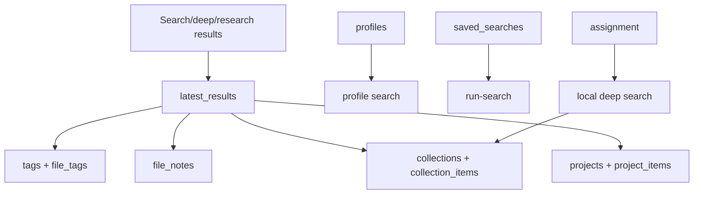

Tags and notes resolve transient result IDs through `latest_results` and then
attach to stable `file_id` values. Collections and projects also store `file_id`
references. SQLite foreign keys cascade these rows when file records are
removed.

Sources: `kgfs/workflows/*.py`, `kgfs/cli/commands/profiles.py`, `kgfs/cli/commands/saved_searches.py`, `kgfs/cli/commands/collections.py`, `kgfs/cli/commands/tags.py`, `kgfs/cli/commands/notes.py`, `kgfs/cli/commands/assignment.py`, `kgfs/cli/commands/projects.py`, `tests/test_phase7_workflows.py`.

## File Intelligence Lifecycle

Phase 8 intelligence features analyze KGFS metadata without writing to source
files:

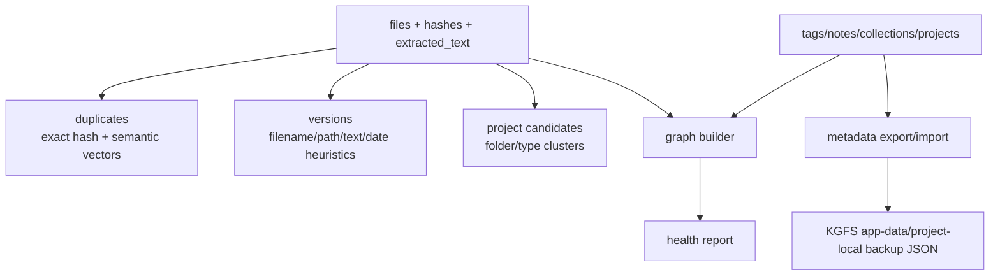

`metadata export` stores stable file identities, workflow rows, and project
metadata. It excludes source file contents, extracted text, OCR cache text,
vector blobs, API keys, and model caches. Imports match metadata back to the
current index by content hash, normalized path, and filename/size fallback.

Sources: `kgfs/intelligence/*.py`, `kgfs/cli/commands/duplicates.py`, `kgfs/cli/commands/versions.py`, `kgfs/cli/commands/graph.py`, `kgfs/cli/commands/health.py`, `kgfs/cli/commands/metadata.py`, `tests/test_phase8_file_intelligence.py`.

## Result Explanation Lifecycle

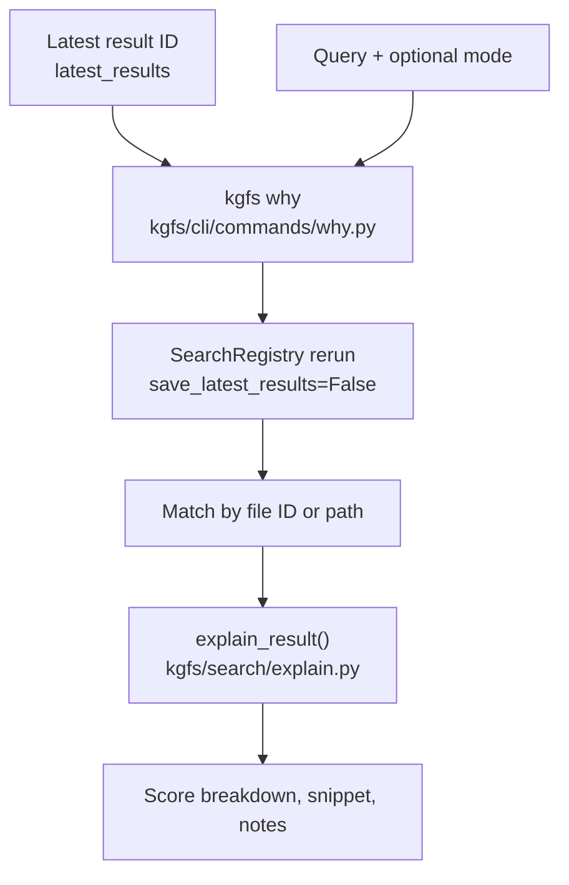

`kgfs why` explains saved latest-result IDs. It reruns search with the requested
mode, uses the saved file if the result no longer appears in the rerun, and
prints score components from `SearchResult.score_breakdown`.

Sources: `kgfs/cli/commands/why.py`, `kgfs/search/explain.py`, `kgfs/search/result.py`, `tests/test_cli.py`.

## Keyword Ranking

Keyword search builds an FTS5 query with `build_fts_query()`:

- Tokenizes with Unicode word matching.
- Removes a fixed stopword list.
- Uses prefix terms such as `motor*`.
- Uses `AND` first, then falls back to `OR` if no rows are found.

Ranking combines:

- BM25-derived base score.
- Filename match boost.
- Path match boost.
- Exact phrase match boost.
- Small recent-modification bonus.

Sources: `kgfs/search/query.py`, `kgfs/search/ranking.py`, `kgfs/search/keyword.py`, `tests/test_ranking.py`.

## Semantic and Hybrid Search

Semantic indexing:

1. Extracted text is split by `chunk_text()`.
2. `SentenceTransformerEmbedder` encodes chunks with normalized embeddings.
3. Vectors are packed as little-endian float32 BLOBs.
4. Chunks are stored with file ID, chunk index, text, embedding dimension, offsets, model name, and created timestamp.

Vector backend foundation:

1. `kgfs/search/backends/base.py` defines the vector backend protocol and
   `VectorSearchHit` / `VectorSearchOptions` / `VectorIndexStatus`.
2. `kgfs/search/backends/registry.py` registers known backend names and keeps
   optional dependencies lazy.
3. `kgfs/search/backends/sqlite_scan.py` is the default backend. It scans
   SQLite `chunks`, unpacks BLOB vectors, computes cosine similarity in Python,
   and applies search filters.
4. `sqlite_vec`, `hnsw`, and `faiss` are optional accelerated backends. They
   build/search from KGFS `chunks` when their dependencies are installed and
   enabled, and otherwise report clear unavailable status without making the
   base install import heavy packages.
5. `kgfs/vectors/` owns vector status, clearing, rebuild lifecycle helpers,
   artifact paths, artifact metadata, benchmarking, and recommendation logic.
6. `kgfs vector status`, `kgfs vector rebuild`, `kgfs vector clear --yes`,
   `kgfs vector benchmark`, and `kgfs vector recommend` manage or inspect local
   vector data only.

Semantic search:

1. Embeds the query.
2. Routes the query vector through the configured vector backend.
3. Converts vector hits into `SearchResult` rows.
4. Returns the best chunk per file.

Hybrid search combines semantic score, keyword score, filename relevance, path
relevance, exact phrase relevance, and modest recency. Hybrid results include a
serializable score breakdown with `keyword`, `semantic`, `filename`, `path`,
`exact_phrase`, `recency`, and `final` components. Weights live in the `hybrid`
config section and are normalized at scoring time.

Auto mode uses hybrid only when semantic/vector data is ready. If semantic is
disabled, auto quietly uses keyword; if semantic is enabled but not ready, auto
prints one fallback warning and uses keyword.

`kgfs why RESULT_ID QUERY` reads the latest saved search result, reruns local
search, and formats a `SearchExplanation`. It does not open files, reveal
folders, call AI, or modify indexed source files.

Sources: `kgfs/search/semantic.py`, `kgfs/search/keyword.py`, `kgfs/search/backends/*.py`, `kgfs/search/modes/semantic.py`, `kgfs/search/modes/hybrid.py`, `kgfs/vectors/*.py`, `tests/test_semantic.py`, `tests/test_vector_backend.py`, `tests/test_vector_backend_registry.py`, `tests/test_vector_benchmark.py`, `tests/test_vector_recommend.py`, `tests/test_vector_status.py`.

## Database Architecture

SQLite is the only persistence layer at this commit.

Tables:

- `files`: indexed file metadata, extracted text, status, hash, and timestamps.
- `files_fts`: FTS5 virtual table for file name, path, and extracted text.
- `latest_results`: most recent search result IDs for open/reveal.
- `chunks`: semantic text chunks and vector BLOBs.
- `schema_version`: migration version marker.
- `ocr_cache`: local OCR result cache keyed by source identity/backend/language.
- `media_metadata`, `media_text`, `media_embeddings`: optional local media metadata, searchable generated text, and future media embeddings.
- Workflow tables: `profiles`, `saved_searches`, `collections`, `collection_items`, `tags`, `file_tags`, `file_notes`, `projects`, `project_items`, and `assignment_runs`.
- Intelligence tables: `graph_edges`, `project_candidates`, and `metadata_backups`.

`initialize_database()` creates core tables, calls `migrate_database()`, and commits. Current schema version is `5`.

Sources: `kgfs/db/schema.py`, `kgfs/db/migrations.py`, `kgfs/db/repositories.py`, `kgfs/db/latest_results.py`, [Data Model](data-model.md).

## Web Dashboard Architecture

`create_app()` builds a FastAPI app and mounts static assets from resource paths that work in source checkouts and PyInstaller bundles.

Routes:

- `GET /`: summary metrics plus vector/OCR/media/health status.
- `GET /search`: registry search with mode/filter controls.
- `GET /collections`: local collections.
- `GET /tags`: local tags.
- `GET /projects`: local projects.
- `GET /graph`: bounded local topic graph.
- `GET /health`: local health report.
- `GET /stats`: database stats.
- `GET /config`: active config dump.
- `GET /failures`: recent extraction failures.
- `GET /open/{result_id}` and `GET /reveal/{result_id}`: OS open/reveal actions for latest results.

Sources: `kgfs/web/app.py`, `kgfs/core/resources.py`, `kgfs/web/templates/*.html`, `tests/test_web.py`.

## Local API, TUI, and Integration Architecture

The additional UX surfaces are intentionally local and lightweight:

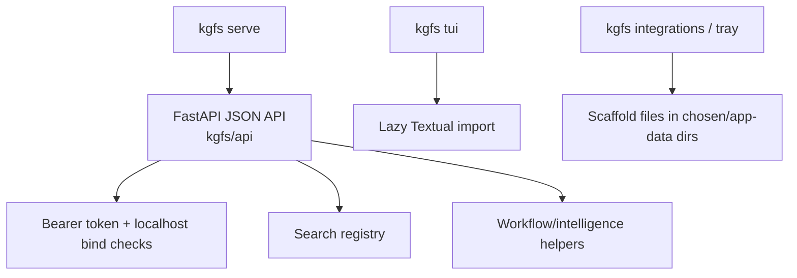

The API requires bearer-token auth by default, refuses non-localhost binds unless explicitly allowed, and keeps open/reveal endpoints disabled unless `api.allow_file_actions` is true. File actions use latest result IDs only.

The TUI imports Textual only when `kgfs tui` runs. Integration scaffold commands write templates/README files only; they do not install OS plugins or edit system settings.

Sources: `kgfs/api/*.py`, `kgfs/tui/*.py`, `kgfs/integrations/*.py`, `tests/test_phase9_ux_integrations.py`.

## AI Assist Architecture

AI Assist is downstream of local search:

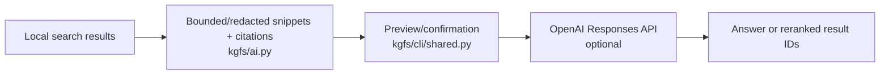

Privacy defaults:

- Disabled by default.
- Requires API key from environment.
- Sends snippets, not full file text.
- Omits paths by default.
- Redacts home paths by default.
- Prints preview and asks for confirmation by default.

Sources: `kgfs/ai.py`, `kgfs/cli/commands/search.py`, `kgfs/cli/shared.py`, `tests/test_ai.py`.

## Error Handling

| Area | Behavior | Source |
|---|---|---|
| Missing config for required runtime | `load_config()` reads the resolved path and will fail if missing. | `kgfs/core/config.py`, `kgfs/cli/shared.py` |
| Optional config runtime | Commands such as `doctor` and `reset-index` use defaults when config is missing. | `kgfs/cli/shared.py` |
| Risky roots | CLI exits with code 2; library raises `RiskyRootError`. | `kgfs/cli/commands/index.py`, `kgfs/indexing/indexer.py` |
| Missing or unreadable files during discovery | Missing roots skipped; stat errors skip file and can increment failures. | `kgfs/indexing/discovery.py`, `kgfs/indexing/indexer.py` |
| Extraction failures | Stored with `extraction_status="error"` and `extraction_error`. | `kgfs/extractors/*.py`, `kgfs/indexing/indexer.py` |
| FTS query operational error | Keyword search returns an empty result list. | `kgfs/search/keyword.py` |
| Unknown search mode | Raises `UnknownSearchMode`; CLI reports bad parameter. | `kgfs/search/registry.py`, `kgfs/cli/commands/search.py` |
| Semantic unavailable | Raises `SearchModeUnavailable` for explicit semantic/hybrid search. Auto falls back to keyword with warning. | `kgfs/search/registry.py`, `kgfs/search/modes/semantic.py` |
| Unknown vector backend | Vector status reports unavailable; semantic/hybrid modes report a helpful unavailable message with known backend names. | `kgfs/search/backends/registry.py`, `kgfs/vectors/status.py` |
| Optional vector backend unavailable or stale | Backend reports missing dependency, disabled config, missing artifact, stale metadata, or dimension mismatch instead of pretending search succeeded. | `kgfs/search/backends/*.py`, `kgfs/vectors/metadata.py` |
| OCR disabled or missing Tesseract | Images remain ignored unless OCR is enabled; OCR status/extraction reports missing local command with install guidance. | `kgfs/indexing/filters.py`, `kgfs/ocr/tesseract.py` |
| Media disabled or missing optional dependencies | Media files remain ignored unless media/photos are enabled; media status and EXIF commands report missing optional dependencies with guidance. | `kgfs/indexing/filters.py`, `kgfs/media/status.py`, `kgfs/media/exif.py` |
| Optional model backend disabled or unavailable | Model commands report readiness, missing dependencies, missing local model paths, download guards, and indexed-folder path warnings instead of importing heavy stacks at startup or faking success. | `kgfs/models/*.py`, `kgfs/cli/commands/models.py` |
| Cloud OCR fallback | Disabled by default and scaffolded to refuse upload even after confirmation until a real provider path exists. | `kgfs/ocr/cloud.py` |
| API token missing or invalid | Missing configured token env returns HTTP 503; wrong/missing bearer token returns HTTP 401. | `kgfs/api/auth.py` |
| API non-local bind | `kgfs serve` raises a bad-parameter error unless `--allow-network` is supplied. | `kgfs/api/auth.py`, `kgfs/cli/commands/serve.py` |
| API file action disabled | `/open/{result_id}` and `/reveal/{result_id}` return 403 unless `api.allow_file_actions` is true. | `kgfs/api/routes.py` |
| TUI dependency missing | `kgfs tui --check` reports missing Textual; launch raises a user-facing dependency error. | `kgfs/tui/app.py`, `kgfs/cli/commands/tui.py` |
| AI disabled, missing SDK, missing API key, unsupported provider | Raises `AIError`; CLI reports bad parameter. | `kgfs/ai.py`, `kgfs/cli/commands/search.py` |
| Newer DB schema | Raises `RuntimeError`. | `kgfs/db/migrations.py` |

## Logging and Telemetry

No structured logging or telemetry pipeline is implemented at this commit. `kgfs doctor` reports a log path from platformdirs, but no code writes runtime logs there. Console output uses Rich through `kgfs/cli/shared.py`.

Sources: `kgfs/cli/shared.py`, `kgfs/cli/commands/doctor.py`, `kgfs/core/app_dirs.py`.

## Security and Auth Boundaries

- Indexing is opt-in by configured path.
- Risky roots are blocked by default.
- Prune/reset do not delete source files.
- Open/reveal behavior is isolated in `kgfs/core/platform_utils.py`; tests enforce that `platform.system()` checks are not scattered.
- Web dashboard has no authentication and should stay bound to localhost unless the operator understands the exposure.
- Local JSON API requires a bearer token by default and refuses network binds unless explicitly allowed.
- Integration scaffolds write local template files only and do not install OS integrations.
- AI Assist is opt-in and context-bounded.
- OCR, media, and optional local model features are opt-in, local-first, and write only KGFS database/cache data.

Sources: `AGENTS.md`, `kgfs/core/safety.py`, `kgfs/core/platform_utils.py`, `tests/test_platform_boundary.py`, [Security](security.md).

## Extension Points

| Extension | Where to change | Required tests |
|---|---|---|
| New CLI command | Add module under `kgfs/cli/commands/` and register it in `kgfs/cli/app.py`. | CLI exposure and behavior tests in `tests/test_cli.py` or focused test file. |
| New config key | Add Pydantic field in `kgfs/core/config.py`, update `DEFAULT_CONFIG_YAML`, `config.example.yaml`, docs, and tests. | `tests/test_config.py` plus feature tests. |
| New extractor | Add extractor module under `kgfs/extractors/`, update dispatch in `kgfs/extractors/__init__.py`, update default extensions if enabled by default. | `tests/test_extractors.py` and indexing/search tests. |
| New OCR backend | Add backend under `kgfs/ocr/`, register it lazily, keep source files untouched, and update status/docs. | OCR backend/status/cache/indexing tests. |
| New media backend | Add backend or helper under `kgfs/media/`, keep dependencies lazy, store generated data in KGFS DB/cache only, and update status/docs. | Media config/status/search/safety tests. |
| New local model backend | Add validation/status/snippet/test support under `kgfs/models/`, connect it to the OCR or media backend registry, keep downloads disabled by default, and update local-model docs. | `tests/test_phase10_1_local_models.py`, `tests/test_phase10_2_local_model_setup.py`, plus backend-specific tests. |
| New DB schema | Update `kgfs/db/schema.py`, migration logic in `kgfs/db/migrations.py`, and data-model docs. | `tests/test_migrations.py` and repository tests. |
| New intelligence workflow | Add logic under `kgfs/intelligence/`, expose CLI under `kgfs/cli/commands/`, and keep source files untouched. | Focused Phase 8-style tests using temporary databases and source-hash checks. |
| New search mode | Add engine under `kgfs/search/modes/`, register in `build_default_search_registry()`, extend `SearchMode` enum if user-facing. | `tests/test_search_kernel.py`, CLI tests if exposed. |
| New web route | Add route in `kgfs/web/app.py` and template/static assets as needed. | `tests/test_web.py`. |
| New JSON API route | Add route/model logic under `kgfs/api/`, preserve local bind/token/file-action boundaries, and document the endpoint. | API tests in `tests/test_phase9_ux_integrations.py` or focused API tests. |
| New TUI behavior | Add lazy Textual-backed code under `kgfs/tui/`; keep base CLI imports independent of Textual. | TUI dependency-check tests and focused state/action tests. |
| New local integration scaffold | Add writer under `kgfs/integrations/`, expose it in `kgfs/cli/commands/integrations.py`, and ensure it writes only to the selected output directory. | Scaffold tests that verify no source/system changes. |
| New packaging asset | Update `packaging/pyinstaller/kgfs.spec` and `scripts/build_package.py` archive contents. | `tests/test_packaging_scripts.py`, packaged smoke test. |
